# Mix-CV UB Pass Lab：设计说明

## 目标

为算子/编译初学者建立一条可复现的 HIVM 编译实验：以一个 Cube + Vector 融合（mix-CV）算子为输入，逐个运行与 UB 建模相关的 pass，保存每一步前后的 IR，并解释每个 IR 变化对 UB overflow 预测的含义。

实验不是为了复刻完整的产品编译命令；它的目标是把完整 pipeline 中会改变下列四项的 pass 单独暴露出来：

- buffer 的来源与大小；
- buffer 的 memory scope（UB、GM、L1、L0 等）；
- buffer 的并发份数（multi-buffer）；
- buffer 的存活区间和最终地址布局。

## 学习样例

源样例来自 AscendNPU-IR：

`bishengir/test/Dialect/HFusion/OpFusion/test_mix_cv.mlir` 中的 `testChain`。

它的高层语义是：

```text
arg0 --floor--> t1 --floor--> t2 --matmul(t2, t2)--> t3 --ceil--> result
                 Vector                 Cube                 Vector
```

这里的 Vector 指向量/逐元素计算路径，Cube 指矩阵乘路径。`mix-CV` 不是一条新的硬件流水线，而是编译器识别到同一融合 kernel 同时含 Cube 和 Vector 工作后，对二者交接、同步、暂存和流水化作的专门处理。

## 实验输入与输出

### 输入

一个独立、最小化的 `.mlir` 文件；它保留 `testChain` 的“Vector → Cube → Vector”依赖，但不混入原测试文件中无关的复杂函数。

### 每个 pass 的输出

每步保存：

```text
NN_<pass-name>.before.mlir
NN_<pass-name>.after.mlir
```

并在讲解文档记录：输入摘录、输出摘录、结构化 diff、概念解释、pass 的实现原理、UB 建模影响。IR 快照是事实依据；文档中的结论不能脱离快照。

每个 pass 采用同一张“前后对照卡”：

| 项目 | 必须回答的问题 |
|---|---|
| 触发条件 | 它识别什么 op、scope、循环或属性？ |
| 实现原理 | 它通过插入、改写、标记、lowering 或分析，具体怎样完成工作？ |
| 输入 MLIR | pass 前哪些 SSA value、op 或 attribute 是关键证据？ |
| 输出 MLIR | 新增、删除、改写了哪些 op/attribute/type？ |
| 对比结论 | 为什么这个变化能够实现该 pass 的目的？ |
| UB 影响 | 它改变了 buffer 集合、大小、scope、活跃区间或 multi-buffer 哪一项？ |

## Pass 链与两个建模检查点

```mermaid
flowchart LR
  A["HIVM Tensor IR / mix-CV"] --> B["InsertLoadStoreForMixCV"]
  B --> C["InsertWorkspaceForMixCV"]
  C --> D["检查点 A：Mark #1 前"]
  D --> E["MarkMultiBuffer #1"]
  E --> F["CVPipelining"]
  F --> G["Bufferization"]
  G --> H["InferHIVMMemScope + SetBufferSize"]
  H --> I["检查点 B：Mark #2 前"]
  I --> J["MarkMultiBuffer #2"]
  J --> K["PlanMemory(Local)"]
  K --> L["EnableMultiBuffer"]
```



### A. `InsertLoadStoreForMixCV`

目的：将 Cube 与 Vector 阶段之间原本隐含在 tensor SSA use-def 链中的数据交接，显式化为 load/store 或中间对象。它回答“这个值要从哪里读、写到哪里给下一阶段用”。

实现原理：扫描 mix-CV 函数内跨 Cube/Vector 边界的 producer-consumer 关系；当一个 tensor 值不能作为同一执行域内的直接 SSA 传递时，插入显式的存储端和读取端，使数据交接变成可被后续 bufferization、memory-scope 推断和流水化处理的 IR 边。

建模作用：建立 Cube↔Vector bridge 的候选记录。此时不能把所有中间对象直接计为 UB，因为 memory scope 还没有完全确定。

### B. `InsertWorkspaceForMixCV`

目的：为 mix-CV 的跨阶段暂存或协作插入 workspace 对象。workspace 通常指位于 GM 或全局工作区的临时内存，不等于 UB。

实现原理：根据已显式化的跨阶段读写以及融合的执行边界，创建 workspace 分配/函数参数绑定，并把相应的 producer 写和 consumer 读连接到该对象；它把“需要跨阶段保存的数据”从隐式语义变为可追踪资源。

建模作用：记录 workspace 的大小、读写方向、是否位于循环/scope 内。它会影响数据交接和生命周期，但不应直接加进 UB bytes。

### 检查点 A：第一次 `MarkMultiBuffer` 前

这是 Tensor/语义层检查点。它用来提取：Cube-Vector 顺序、scope、loop、preload、workspace、以及哪些对象有可能因流水化被多缓冲。它回答“为什么这个融合结构可能增加 UB 压力”。

### C. `MarkMultiBuffer #1`

目的：分析 scope、循环、load/store、workspace 等模式，为候选对象插入 `annotation.mark {hivm.multi_buffer = N}`。该 pass **只打标记，不分配 N 份物理地址，也不直接复制数据**。

实现原理：以 loop/scope 中相邻迭代能否重叠为前提，沿 load/store 和 buffer use-def 关系寻找可轮转的暂存对象；满足规则的对象加上 `hivm.multi_buffer` annotation。L0C 等不适用对象会被排除，具体候选受 pass option 的 local-buffer/workspace 限制控制。

建模作用：模拟同样的候选识别规则，产生 `multi_buffer_factor`。资源估算中，候选 buffer 的容量需要按 `size × N` 计算；真实布局仍以后续 PlanMemory 为准。

### D. `CVPipelining`

目的：消费 mix-CV 的结构和 multi-buffer 标记，将不同迭代的搬运/计算交叠，形成流水。核心收益是隐藏访存或 Cube/Vector 等待；代价是同时存活的 buffer 份数增加。

实现原理：重写 loop/scope 内的调度，使迭代 i 的计算能与 i+1 的读写并行推进；multi-buffer 标记为跨迭代轮转提供合法的独立缓冲槽。最终具体槽位选择不在此 pass 完成，而在 `EnableMultiBuffer` 物化。

建模作用：更新 buffer 的重叠生命周期。仅有 `size × N` 还是上界近似；要预测峰值，还需要知道同一时刻有哪些对象活跃。

### E. Bufferization

目的：把 tensor SSA（值语义）转为 `memref`（存储语义）。tensor 表示“产生一个值”，memref 表示“有一块可寻址的内存”。

实现原理：依据 destination-passing style、alias 和读写关系，为 tensor value 选择已有存储或插入/传播 memref；同时将 tensor 类型的 operand/result 改写为 memref 类型。这样后续 pass 可以讨论“哪块内存”而不是只讨论“哪个值”。

建模作用：从这一阶段起，可稳定追踪 alloc、alias、subview、copy、load/store 和生存期；它是精确 UB 资源模型的前提。

### F. `InferHIVMMemScope` 与 buffer-size 推断

目的：给 memref 推断 memory scope/address space（例如 UB、GM、L1、L0A/L0B/L0C），并确定静态 buffer 的字节数。

实现原理：结合 HIVM op 的输入/输出约束、producer/consumer 类型和局部存储用途，为 memref 附加或改写 address-space 属性；size 推断则由 shape 各维乘积、element type 字节数与必要的布局/对齐规则得出。

建模作用：只对 UB address space 的真实 buffer 计入 UB 峰值。Cube 的 L0/L1 不计入 UB bytes，但其与 Vector 的 bridge/workspace 信息保留为风险来源。

### 检查点 B：第二次 `MarkMultiBuffer` 前

这是 Buffer/资源层检查点。它用来提取每个真实 local buffer：shape、dtype、bytes、address space、定义点、最后使用点、scope 和 producer/consumer。

### G. `MarkMultiBuffer #2`

目的：在 bufferization、分解、scope/memory-scope 推断后，识别第一阶段尚不可见的真实 local buffer（特别是 UB temp）。

实现原理：使用与第一次同类的候选规则，但输入已是带 memory scope 的 memref IR；因此它能直接判断 local/UB buffer，并在 pipeline 中强制启用“仅 local buffer”的限制。

建模作用：这是 UB 主模型必须模拟的一次标记。每个 UB buffer 最终记录为 `bytes × multi_buffer_factor`，并将 factor 的来源注明为 Mark #1 或 Mark #2。

### H. `PlanMemory(Local)`

目的：根据 buffer size、生命周期、scope、multi-buffer 标记，为 local memory 规划地址和复用；IR 里常体现为 `memref.alloc` 被替换成一个或多个 `hivm.hir.pointer_cast(offset...)`。

实现原理：先分析 alloc 的定义点和最后使用点得到 live range，再按 address space 分组进行区间复用；带 `multi_buffer=N` 的对象预留 N 个 slot。分配完成后，用带 offset 的 pointer cast 代替抽象 alloc，以便后端使用确定的局部地址。

建模作用：它是模型的“对齐标签”。模型预测的是每个 program point 的存活 UB 总和；PlanMemory 提供实际 slot/offset 和复用结果，用于回归验证。

### I. `EnableMultiBuffer`

目的：把 `multi_buffer=N` 从声明性标记落实为可执行的轮转选择，例如按循环迭代 `mod N` 从 N 个 address slot 中选一个。

实现原理：把 PlanMemory 产生的 N 个候选地址展开，并在相应循环内生成基于迭代编号的取模/比较/选择 IR，使每轮使用不同 slot；随后保留正确的 producer/consumer 引用。

建模作用：验证 `N` 不是抽象系数，而是 N 个可同时参与流水的物理槽位。

## UB 白盒模型输出

模型输出一份按 program point 聚合的报告：

```text
UBPeakReport
  peak_bytes
  ub_capacity_bytes
  overflow: true | false | unknown
  peak_program_point
  live_buffers[]:
    id, shape, dtype, bytes, multi_buffer_factor,
    contribution_bytes, scope, producer, users,
    born_at, dead_at, mark_source
  cv_context:
    cube_vector_bridges, workspace, scopes, pipeline loops
```

峰值计算口径：

```text
UB_peak(t) = Σ [buffer 在 t 活跃且 address_space = UB]
             buffer.bytes × buffer.multi_buffer_factor
```

其中 workspace、GM、L1、L0A/L0B/L0C 不直接计入 `UB_peak`；但它们会作为解释特征保留。

## 验证标准

1. 每个 pass 均可由 `bishengir-opt` 在本机单独运行，且保存输入/输出快照。
2. 文档中的每个“IR 发生了什么”都能在相邻快照中定位，并以 before/after 对照展示。
3. 至少展示一次 `hivm.multi_buffer=N` 的标记、一次 local PlanMemory 的多 slot 地址、一次 EnableMultiBuffer 的循环选槽。
4. 每个 pass 都解释其触发条件、实现原理、IR 改写和 UB 影响，而非仅描述 pass 名称。
5. 最终报告能区分：真实 UB buffer、非 UB workspace、Cube 侧非 UB 内存，以及它们之间的因果关系。

## 非目标

- 不在本实验中重建完整 `bishengir-compile` 端到端产物；该路径依赖本机缺失的 `hivmc`。
- 不将 PlanMemory 的具体地址布局等同于唯一正确的 UB 峰值公式；其复用策略依赖控制流和 pass 实现。
- 不把 Cube 的 L0/L1 容量混入 UB 容量。
