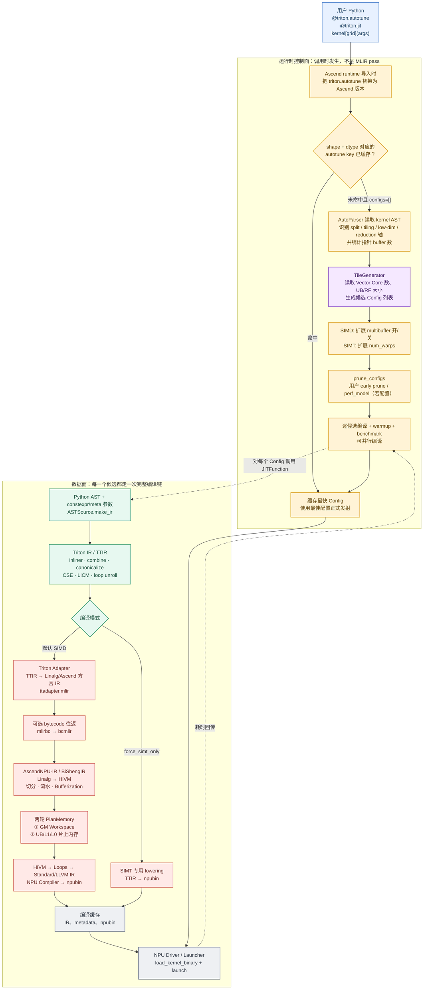
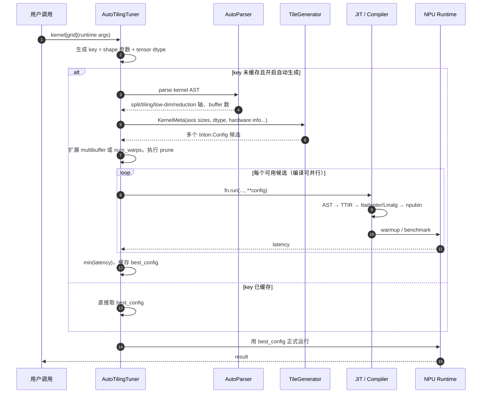
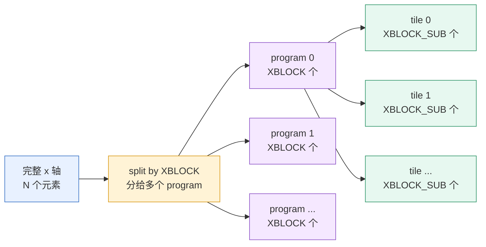
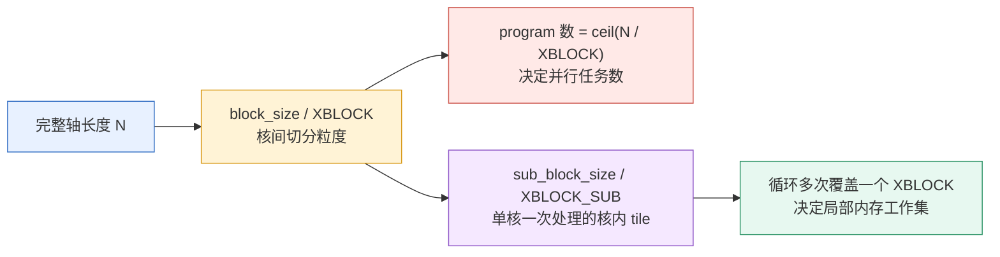
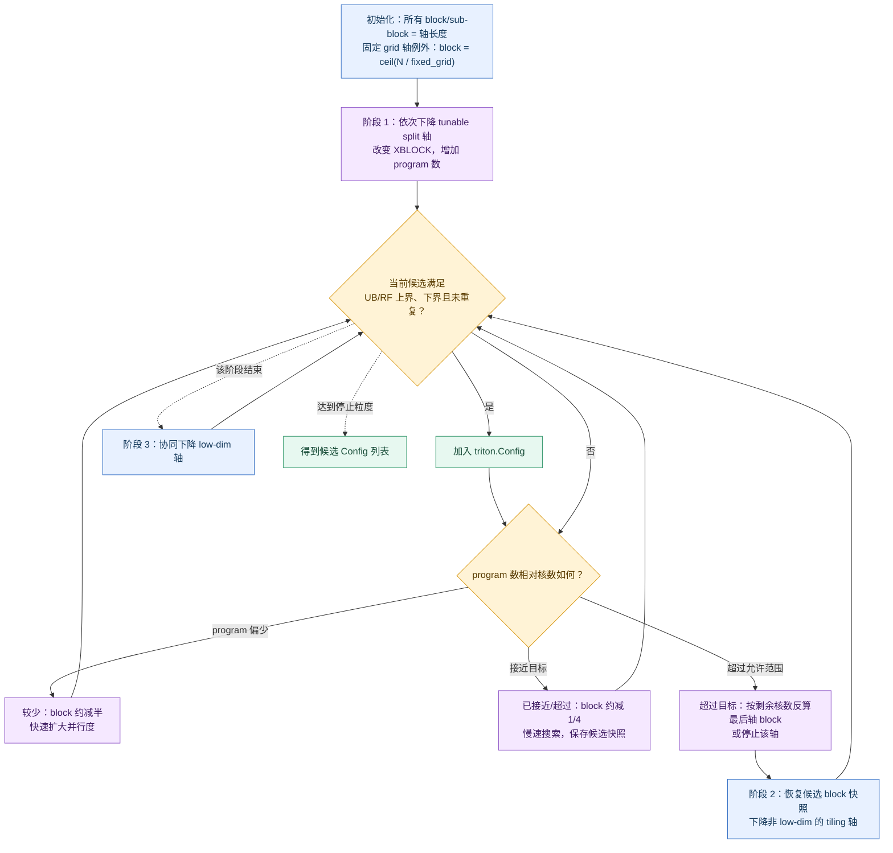
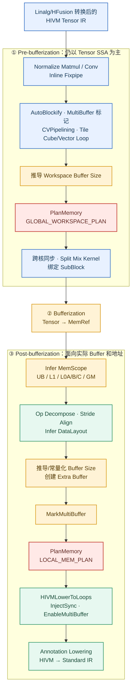

# Triton-Ascend 编译全景与 TileGenerator 切分机制

> 本文基于当前仓库代码说明两件事：Triton kernel 从 Python 到 NPU 二进制的完整路径，以及 Ascend 自动 Tiling 如何根据核数和 UB/RF 容量生成候选方案。
>
> 先给结论：`TileGenerator` 不在 MLIR 编译 pass 内，而在 **Python 运行时 autotune 控制层**。它也不直接产出唯一的“最优 tile”，而是产出一组满足启发式约束的 `triton.Config`；之后每个候选都会走完整编译链并实机 benchmark，最终由 `AutoTilingTuner` 选择最快者。

---

## 1. 一张图建立全局坐标系



这张图中最重要的分界线是：

- **autotune / AutoParser / TileGenerator 是编译链外层的 Python 调度逻辑**；
- **TTIR → Linalg → HIVM → npubin 才是默认 SIMD 单个配置的编译流水线**；
- autotune 通过改变 `XBLOCK`、`XBLOCK_SUB`、`multibuffer` 等 meta/编译选项，让同一 kernel 被特化并编译多次；
- TileGenerator 做的是“候选生成”，benchmark 做的是“最终裁决”。

## 2. 从装饰器到最终发射的时序



### autotune 究竟在哪个阶段？

它横跨“编译前”和“运行时测量”：第一次遇到新 key 时，先生成候选，再触发每个候选的 JIT 编译和运行测量。它不是编译器内部某个固定 pass。

对应调用链为：

```text
导入 triton.backends.ascend.runtime
  └─ _patch_autotune(): triton.autotune = ascend.autotune

kernel 第一次按某个 shape/dtype 调用
  └─ AutoTilingTuner.run()
      ├─ generate_key_and_configs()
      │   ├─ _autoparse_axis_params()
      │   └─ _gen_tile_configs()
      │       ├─ KernelMeta(...)
      │       ├─ TileGenerator(...)
      │       └─ descend_split_tiling()
      ├─ prune_configs()
      ├─ _batch_bench()
      │   └─ 每个 Config → fn.run() → 完整编译/发射
      ├─ min(timings) → cache[key]
      └─ 用 best_config 再运行一次
```

源码入口：

- Ascend 替换 `triton.autotune`：[`third_party/ascend/backend/runtime/__init__.py`](../third_party/ascend/backend/runtime/__init__.py)
- 候选生成和实测选优：[`third_party/ascend/backend/runtime/autotuner.py`](../third_party/ascend/backend/runtime/autotuner.py)
- Tile 搜索：[`third_party/ascend/backend/runtime/tile_generator.py`](../third_party/ascend/backend/runtime/tile_generator.py)
- 通用编译循环：[`python/triton/compiler/compiler.py`](../python/triton/compiler/compiler.py)
- Ascend 编译 stage 注册：[`third_party/ascend/backend/compiler.py`](../third_party/ascend/backend/compiler.py)
- 二进制加载与发射：[`third_party/ascend/backend/driver.py`](../third_party/ascend/backend/driver.py)

---

## 3. TileGenerator 收到的输入是什么

自动生成仅在 `configs=[]`，或 hints 显式设置 `auto_gen_config=True` 时开启。第一次遇到一个新 key，`AutoTilingTuner` 先从 kernel AST 和实参构造 `KernelMeta`。

如果你第一次接触算子，可以先把技术名词放到一边，想象我们要让很多工人处理一条很长的面包：

```text
完整数据（axis）
────────────────────────────────────────────────────────────

先分给不同工人（split，核间切分）
┌──────────────┬──────────────┬──────────────┬──────────────┐
│ program 0    │ program 1    │ program 2    │ program 3    │
│ XBLOCK 个    │ XBLOCK 个    │ XBLOCK 个    │ XBLOCK 个    │
└──────────────┴──────────────┴──────────────┴──────────────┘

每个工人的工作台放不下整块，再分批处理（tiling，核内切分）
program 0 的 XBLOCK
┌───────┬───────┬───────┬───────┐
│ SUB 0 │ SUB 1 │ SUB 2 │ SUB 3 │  每小块 XBLOCK_SUB 个
└───────┴───────┴───────┴───────┘
```

这里的“工人”更准确地说是 Triton **program**。program 会被调度到 NPU Core 上执行；program 数可以大于物理核数，多出来的 program 分批执行。因此 `program` 和“物理核”不是严格一一对应，但在理解切分时可以先近似看成一组并行工人。

### 3.1 axis：我们沿哪个方向切数据

`axis` 就是数据的一个逻辑方向，也常叫“维度”或“轴”。

一维向量只有一个轴：

```text
x = [0, 1, 2, 3, 4, 5, ...]
     └──────── x axis ────────┘
```

二维矩阵有两个轴：

```text
             y / 列方向
          ─────────────►
       ┌─────────────────┐
x / 行 │                 │
方向   │      矩阵       │
  │    │                 │
  ▼    └─────────────────┘
```

在自动 Tiling 中，`x`、`y`、`z` 只是 TileGenerator 给逻辑轴起的内部名字，不等同于 Python 变量名，也不天然表示固定的物理方向。使用列表形式的 `key=["M", "N"]` 时，当前实现按顺序把它们映射为：

```text
x axis → M
y axis → N
```

如果某个轴是规约轴，会加 `r` 前缀，例如 `rx`。规约可以先理解为“很多元素最后合成一个结果”，如求和：

```text
[1, 2, 3, 4] --sum--> 10
 └── reduction axis ──┘
```

所以 `axis_sizes={"x": 1_000_000}` 的意思只是：逻辑 `x` 轴有一百万个元素。

### 3.2 split：不同 program 如何瓜分完整数据

`split` 是**核间/程序间切分**。它回答：

> 完整轴很长，启动多少个 program，每个 program 负责其中哪一段？

典型代码是：

```python
pid = tl.program_id(0)
block_start = pid * XBLOCK
```

- `pid` 是当前 program 的编号：0、1、2……；
- `XBLOCK` 是每个 program 负责的元素数；
- `pid * XBLOCK` 是当前 program 的起点。

若 `N=1000`、`XBLOCK=256`：

```text
program 0 → [  0,  256)
program 1 → [256,  512)
program 2 → [512,  768)
program 3 → [768, 1000)  最后一块不足 256，用 mask 防越界
```

需要启动：

\[
programs=\left\lceil\frac{N}{XBLOCK}\right\rceil
=\left\lceil\frac{1000}{256}\right\rceil=4
\]

因此：

- `XBLOCK` 越大，每个 program 干得越多，program 数越少；
- `XBLOCK` 越小，每个 program 干得越少，program 数越多；
- program 太少喂不满核心，太多则会增加调度和尾块开销。

AutoParser 主要通过 `tl.program_id(...) * 某个参数` 这种 AST 模式识别 split 参数。得到的结果可能是：

```python
split_params = {"x": "XBLOCK"}
```

含义是：逻辑 `x` 轴由 `XBLOCK` 控制核间切分。

### 3.3 tiling：一个 program 内部如何分批处理

`tiling` 是**核内切分**。它回答：

> 一个 program 已经领到了 `XBLOCK` 个元素，但 UB 一次放不下，应该每轮处理多少个？

这个“每轮处理量”通常叫 `XBLOCK_SUB`：

```python
for sub_start in range(0, XBLOCK, XBLOCK_SUB):
    offsets = block_start + sub_start + tl.arange(0, XBLOCK_SUB)
    # 每轮 load / compute / store XBLOCK_SUB 个元素
```

假设 `XBLOCK=1024`、`XBLOCK_SUB=256`：

```text
一个 program 负责 1024 个元素

第 1 轮：[  0,  256)  ┐
第 2 轮：[256,  512)  │ 每轮只把约 256 个元素的工作集放入 UB
第 3 轮：[512,  768)  │
第 4 轮：[768, 1024)  ┘
```

因此 `XBLOCK` 和 `XBLOCK_SUB` 控制的是两个不同层次：

| 参数 | 控制层次 | 主要影响 |
|---|---|---|
| `XBLOCK` | program 之间 | grid/program 数、核间并行度 |
| `XBLOCK_SUB` | 一个 program 内部 | 每轮 UB 工作集、循环轮数 |

AutoParser 主要通过 `tl.arange(0, 某个参数)` 识别核内 tiling 参数。结果可能是：

```python
tiling_params = {"x": "XBLOCK_SUB"}
```

含义是：逻辑 `x` 轴的核内 tile 大小由 `XBLOCK_SUB` 控制。

### 3.4 一个 axis 可以同时 split 和 tiling

这并不矛盾。还是那条长度为 `N` 的一维轴：



同一 `x` 轴先被 `XBLOCK` 横向分给不同 program，再在每个 program 内被 `XBLOCK_SUB` 分成多轮。

### 3.5 low_dim：不是“长度很小的轴”

`low_dim` 这个名字很容易误会。这里更接近“张量索引中较低/最内层的维度”，通常是二维张量最右边、内存连续的那一维；它**不是按照轴长度是否很小来判断**。

例如：

```python
row = tl.arange(0, BLOCK_M)[:, None]   # 扩展在左边维度
col = tl.arange(0, BLOCK_N)[None, :]   # 位于最右/最内层维度
```

概念上 `col` 对应的列轴更可能被识别为 low-dim。当前 `LowDimsAxesParser` 会检查 `tl.arange` 产生的变量如何参与 `[:, None]`、`[None, :]` 一类切片/维度扩展，再结合 `mask < axis_length` 找回它属于哪个逻辑轴。

为什么要单独标记它？因为多个低维轴存在时，TileGenerator 不希望把其中一个一路缩到很小而其他轴保持巨大，而是倾向于协同下降这些轴的 `sub_block_size`，保持更合理的 tile 形状。

对一维向量，唯一的 `x` 轴通常也就是最内层轴，可被视为 low-dim。

### 3.6 完整例子：从 kernel 到 TileGenerator 输入

下面是一维向量加法。为了把两层切分展示清楚，它同时使用 `XBLOCK` 和 `XBLOCK_SUB`：

```python
import triton
import triton.language as tl


@triton.autotune(configs=[], key=["N"])
@triton.jit
def add_kernel(
    x_ptr,
    y_ptr,
    out_ptr,
    N,
    XBLOCK: tl.constexpr,
    XBLOCK_SUB: tl.constexpr,
):
    # 核间 split：不同 program 领取不同的 XBLOCK。
    pid = tl.program_id(axis=0)
    block_start = pid * XBLOCK

    # 核内 tiling：当前 program 再把 XBLOCK 分成多轮。
    for sub_start in range(0, XBLOCK, XBLOCK_SUB):
        offsets = block_start + sub_start + tl.arange(0, XBLOCK_SUB)
        # 第一个条件保护数组末尾，第二个条件保护当前 XBLOCK 的末尾。
        mask = (offsets < N) & (offsets < block_start + XBLOCK)

        x = tl.load(x_ptr + offsets, mask=mask)
        y = tl.load(y_ptr + offsets, mask=mask)
        tl.store(out_ptr + offsets, x + y, mask=mask)
```

调用时 grid 必须依赖 autotune 的 meta 参数：

```python
grid = lambda meta: (triton.cdiv(N, meta["XBLOCK"]),)
add_kernel[grid](x, y, out, N)
```

假设运行时：

```text
N = 4096
TileGenerator 的一个候选：XBLOCK=1024, XBLOCK_SUB=256
```

完整执行布局就是：

```text
grid = ceil(4096 / 1024) = 4 个 program

program 0：负责 [   0, 1024)，内部 4 轮，每轮 256
program 1：负责 [1024, 2048)，内部 4 轮，每轮 256
program 2：负责 [2048, 3072)，内部 4 轮，每轮 256
program 3：负责 [3072, 4096)，内部 4 轮，每轮 256
```

AutoParser 阅读这个 kernel 的 Python AST 后，目标是推导出类似信息：

```python
keys = {"x": "N"}
axis_sizes = {"x": 4096}
split_params = {"x": "XBLOCK"}
tiling_params = {"x": "XBLOCK_SUB"}
low_dim_axes = ["x"]
num_buffers = 3                 # x_ptr、y_ptr、out_ptr
dtype = x.dtype                 # 多个 Tensor 中取字节数最大的 dtype
```

这些信息被装进 `KernelMeta` 后，TileGenerator 才开始回答两个问题：

1. 根据 Vector Core 数，`XBLOCK` 多大才能产生合适数量的 program？
2. 根据 UB/RF 容量，`XBLOCK_SUB` 多大才不会让单轮工作集过大？

它会生成多组候选，例如概念上的：

```text
(XBLOCK=1024, XBLOCK_SUB=256)
(XBLOCK= 512, XBLOCK_SUB=256)
(XBLOCK= 512, XBLOCK_SUB=128)
...
```

这些数字只是帮助理解的示意，不保证该 shape 在具体设备上的实际候选正好如此。真正生成哪些组合还取决于核数、UB、dtype、对齐和 small/tiny kernel 分支；最后仍要逐个编译、benchmark 才知道哪组最快。

### 3.7 回头再看 KernelMeta 输入表

| 输入 | 来源 | 用途 |
|---|---|---|
| `axis_sizes` | autotune `key` 对应的运行时整数 | 每个逻辑轴的总长度 |
| `split_params` | hints 或分析 `tl.program_id()` | 核间切分参数，如 `x → XBLOCK` |
| `fixed_split_params` | 固定 grid 反推 | grid 固定时，每个 program 必须覆盖的大小 |
| `tiling_params` | hints 或分析 `tl.arange()` | 核内切分参数，如 `x → XBLOCK_SUB` |
| `low_dim_axes` | AST 分析 `tl.arange` 的切片/扩维方式 | 标记较低/最内层维度；多个这类轴尽量协同下降 |
| `reduction_axes` | AST 分析 | 标记 reduction；影响 persistent/dual reduction 策略 |
| `dtype` | 所有 Tensor 实参中占字节数最大的 dtype | 把 UB/RF 字节容量换算成元素容量 |
| `num_buffers` | Tensor 指针实参数量 | 粗估同时驻留的输入/输出 buffer 数 |
| `is_simt_mode` | `force_simt_only` | 决定用 UB 还是 RF，以及对齐策略 |

最后把两个“block”概念压缩成一张图：



- `XBLOCK` 回答：“一个 program/核负责多少元素？”
- `XBLOCK_SUB` 回答：“这个 program 每轮把多少元素放进 UB/RF 处理？”
- 一个轴可以同时是 split 轴和 tiling 轴，也可以只属于其中一种。

---

## 4. 核数和 UB/RF 如何变成约束

### 4.1 硬件参数来源

硬件参数在 [`runtime/utils.py`](../third_party/ascend/backend/runtime/utils.py) 中延迟读取并缓存：

```text
num_cube_core = device_properties["num_aicore"]

普通架构：
  num_vector_core = num_cube_core
  UB = 192 KiB

Ascend 910B / 910_93 / 910_95 / 950：
  num_vector_core = num_cube_core × 2

Ascend 910_95 / 950：
  UB = 256 KiB
  RF = 128 KiB
```

默认 SIMD 路径使用 UB；`force_simt_only=True` 时使用 RF。

### 4.2 UB/RF 容量约束

初始化阶段先计算一个“单 tile 最大元素数”：

\[
M_{local} = \left\lfloor
\frac{S_{local\ memory}\times1024}
     {bytes(dtype)\times B}
\right\rfloor
\]

其中：

- `S_local memory`：SIMD 取 UB KiB，SIMT 取 RF KiB；
- `bytes(dtype)`：所有 Tensor 实参中最大 dtype 的字节数；
- `B`：指针 buffer 数，代码取 `num_buffers == 0 ? 3 : min(num_buffers, 3)`。

一个候选只有满足下式才可能加入配置列表：

\[
tile\_numel \le M_{local}
\]

`tile_numel` 是各轴当前局部覆盖量的乘积：

\[
tile\_numel = \prod_i
\begin{cases}
sub\_block_i, & i\text{ 是 tiling 轴}\\
block_i, & i\text{ 不是 tiling 轴}
\end{cases}
\]

注意：这是一个**元素数近似模型**，不是编译器完成 buffer liveness、复用和临时张量分析后的精确 UB 占用。它没有逐一计算中间表达式、广播、mask、对齐 padding 或 multibuffer 的真实空间放大。因此它适合生成候选上界，不能替代后端编译器的最终资源检查。

### 4.3 核数约束

所有 split 轴共同决定 program 总数：

\[
P = \prod_{i\in split\ axes}
\left\lceil\frac{N_i}{block_i}\right\rceil
\]

代码使用 `num_vector_core`（下文记作 `C`）形成几组启发式阈值：

| 阈值 | 含义 |
|---|---|
| `C` | 优先让 split 后的 program 数靠近可用 Vector Core 数 |
| `C / 2` | 普通 kernel 开始保留 candidate block 快照的门槛 |
| `C / 8` | tiny kernel 的低 program 数候选门槛 |
| `65535` | 没有核内 tiling 轴时允许的 program 数硬上限 |

若在处理最后一个 split 轴时发现其他 split 轴已经产生 `splits` 个 program，则会反算当前轴覆盖量：

\[
remaining\_cores = \max\left(1,\left\lfloor\frac{C}{splits}\right\rfloor\right)
\]

\[
block_{last} = \left\lceil\frac{N_{last}}{remaining\_cores}\right\rceil
\]

这就是代码中 `calcu_last_split_blocks()` 的核心：让多维 split 的 program 乘积尽量贴近核数，而不是每个轴都独立切成 `C` 份。

---

## 5. TileGenerator 的搜索过程



搜索顺序固定为：

1. **split 轴**：先决定核间如何分工；
2. **非 low-dim 的 tiling 轴**：再压缩核内一次处理量；
3. **low-dim 轴**：最后多个低维轴协同下降。

### 5.1 初始状态

每个轴默认：

```text
block_size     = axis.length
sub_block_size = block_size
```

固定 grid 轴的初值例外：

```text
block_size = ceil(axis.length / fixed_grid_dim)
```

这意味着搜索从“大 tile、低并行度”出发，逐步缩小，而不是枚举所有整数笛卡尔积。

### 5.2 split 轴如何下降

当 program 数还不高时：

```text
block = ceil(block / 2)
```

当 program 数已超过核数的一半、需要细搜时：

```text
step  = max(1, ceil(block / 4))
block = block - step
```

每次 split block 改变后，`sub_block` 先同步为相同值。后续若这个轴也是 tiling 轴，还可以再单独下降 `sub_block`。

### 5.3 tiling 轴如何下降

非 split 的核内 tile，或 split 完成后的 `sub_block`，按下面规则下降：

```text
sub_block >= 32: sub_block = next_power_of_2(sub_block / 2)
sub_block <  32: sub_block = sub_block - 1
```

因此大尺寸区间主要搜索 2 的幂，小尺寸区间逐元素细搜。

### 5.4 low-dim 轴如何协同下降

对 low-dim 轴不是逐轴一路降到底，而是在循环中一起缩小：

- `sub_block >= 128`：约减半并取 2 的幂；
- `< 128`：减半后同时考虑 32-byte 对齐与 2 的幂；
- 和当前最小轴相差不足 20% 的轴会暂缓下降，避免多个相近小轴同时被过度压缩；
- persistent reduction 轴不下降。

### 5.5 何时停止继续缩小

基础停止粒度为：

\[
stop = \frac{1024}{bytes(dtype)}
\]

例如 FP32 为 256 元素，FP16 为 512 元素。

若完整 kernel 小于 `128K` 元素，则进一步使用核数修正：

\[
stop = \min\left(
\frac{1024}{bytes(dtype)},
\left\lfloor\frac{total\_numel}{2C}\right\rfloor
\right)
\]

意图是：小 kernel 不能只按 UB 大小来切，还要避免 tile 太大导致并行 program 太少。

前 10 个候选，或 small kernel 的候选，允许低于常规过滤下界；之后普通大 kernel 会要求：

```text
tile_numel >= stop_numel + 100
```

这是控制候选数量的搜索剪枝，不是硬件限制。

### 5.6 对齐如何改变最终参数

写入 `Config` 时：

- SIMD：大于一个对齐单位时向上对齐到 32 byte；
- SIMT：向上取 2 的幂；
- SIMD 的 `XBLOCK_SUB` 还会被限制为不超过对应候选 `XBLOCK`。

例如 FP32 的 32-byte 对齐单位是 8 个元素；原始 block 1001 会写成 1008。FP16 的单位是 16 个元素。

---

## 6. 一个带数字的例子

假设一个一维 SIMD Vector kernel：

```text
N                  = 1,048,576
dtype              = float32（4 bytes）
Tensor 指针数      = 3（例如 x, y, out）
UB                 = 192 KiB
Vector Core 数 C   = 40
split 参数         = XBLOCK
tiling 参数        = XBLOCK_SUB
```

### 第一步：算局部内存候选上界

\[
M_{UB}=\frac{192\times1024}{4\times3}=16384\ elements
\]

因此，按这个近似模型，单次核内 tile 的 `tile_numel` 必须不超过 16,384。因为该轴也是 tiling 轴，此处直接约束的是 `XBLOCK_SUB`；`XBLOCK` 可以更大，只要 kernel 用循环分批处理它。

### 第二步：算期望核间 block 尺寸

若希望约 40 个 program 覆盖该轴：

\[
XBLOCK_{core}\approx\left\lceil\frac{1,048,576}{40}\right\rceil=26,215
\]

实际写入 SIMD Config 时会做 FP32 的 8 元素对齐，因此对应值可能变为 26,216。

这说明两个约束天然可能给出不同尺度：

```text
核间：XBLOCK     ≈ 26,215  （约 40 个 program，喂满核心）
核内：XBLOCK_SUB ≤ 16,384  （单轮工作集不超过 UB 近似上界）
```

于是一个有意义的候选形态是：每个 program 负责约 26K 元素，但在核内分成不超过 16K 的子 tile 迭代处理。

### 第三步：不是只保留这一组

生成器还会沿下降轨迹保留附近候选，例如不同的 `XBLOCK` 快照与更小的 `XBLOCK_SUB`。随后 SIMD 路径通常再为每组 tile 扩展 `multibuffer` 的另一种取值。最终形态类似：

```text
Config({XBLOCK: ..., XBLOCK_SUB: ..., multibuffer: True})
Config({XBLOCK: ..., XBLOCK_SUB: ..., multibuffer: False})
...
```

这里故意不把某一组写成“必然输出”：具体候选序列还受轴分类、small/tiny kernel 分支、persistent/dual reduction、固定 grid、候选去重和当前设备核数影响。**公式决定搜索边界和方向，benchmark 决定冠军。**

---

## 7. 特殊分支

### small / tiny kernel

- `small_kernel`：初始各轴 block 乘积 `< 128K`；
- `tiny_kernel`：初始乘积 `<= 32K`。

小 kernel 更看重避免低并行度。tiny kernel 会为 `1 ... C/8` 的低 program 数各保留至多一个候选，并设置 tile floor，避免后续在低并行度区域堆积很多近似小 tile。

### persistent reduction

单 reduction 轴满足下列阈值时标为 persistent：

- reduction 恰好是首个 low-dim 轴：长度 `<= 1024`；
- 其他情况：长度 `<= 64`。

persistent reduction 轴不会在 split/low-dim 阶段继续下降，意图是让规约数据驻留在单个 program 内完成。

### dual reduction

检测到两个及以上 reduction 轴时启用 `dual_reduction`。它会更积极地保存 split 候选，即使 program 数尚未超过通常阈值。

### 固定 grid

如果 grid 的某个维度是固定整数，或 callable grid 经探测后被判断为不随待调 constexpr 改变，该 program-id 维度不会作为 tunable split；代码反推：

\[
fixed\_block=\left\lceil\frac{axis\_length}{fixed\_grid}\right\rceil
\]

因此 grid 固定时，TileGenerator 不会生成与发射语义冲突的 `XBLOCK`。

---

## 8. 候选生成之后发生什么

TileGenerator 返回基础 `Config` 后，还有三层处理：

1. **配置扩展**
   - SIMT：默认把每个基础候选扩成 `num_warps ∈ {8,16,32,64}`；
   - SIMD：若用户未指定 `multibuffer`，为每个候选补一份与架构默认值相反的配置。
2. **prune**
   - 继承通用 `Autotuner.prune_configs()`；
   - 只有用户提供 `early_config_prune` 或 `perf_model/top_k` 时，这层才有额外模型剪枝；TileGenerator 本身不是这个 `perf_model`。
3. **编译和 benchmark**
   - 每个候选的 meta 参数进入 `fn.run()`；
   - meta 参数改变会形成不同特化/缓存 key，触发各自的完整编译；
   - 编译错误、资源超限的候选被排除；
   - 对有效候选实测延迟，取 `min(timings)`；
   - 最优配置按 shape/dtype key 缓存在当前 tuner 中。

候选较多时，Ascend 实现默认用 `ThreadPoolExecutor + AsyncCompileMode` 并行编译；并行的是“候选的编译”，不是 TileGenerator 的搜索本身。

---

## 9. 编译流水线再展开一层

### 9.1 AscendNPU-IR 在哪里

默认 SIMD 路径并不是从 Linalg 直接变成机器码。Triton Adapter 先把 TTIR 转成 Linalg/Ascend IR，随后进入 `AscendNPU-IR` 子模块提供的 BiShengIR/HIVM Pipeline：

```text
Python kernel AST
  │  ASTSource.make_ir(target, options, ...)
  ▼
TTIR
  │  make_ttir(): inliner / combine / canonicalizer / CSE / LICM / DCE / unroll
  ▼
优化后的 TTIR
  │  ttir_to_linalg(): Triton Adapter + Ascend passes
  ▼
ttadapter.mlir（Linalg/Ascend IR）
  │  可选：转 bytecode 再由 bishengir-opt 转回 MLIR
  ▼
AscendNPU-IR / BiShengIR
  │  Linalg/HFusion → HIVM
  ▼
HIVM Tensor IR
  │  结构优化、切分、CV Pipeline、Workspace 规划
  ▼
Bufferization：Tensor → MemRef
  │  推导 MemScope、DataLayout、Buffer Size、片上地址
  ▼
HIVM Buffer IR
  │  HIVM → Loops → Standard/LLVM IR
  ▼
NPU compiler
  ▼
npubin + metadata
  │
  ▼
NPU Driver.load_binary() → Launcher.launch()
```

这里的 `HIVM` 可以理解为面向 Ascend Cube/Vector 指令和存储层次的中间表示。它让编译器仍处于较高层时就能表达：

- 计算运行在 Cube 还是 Vector 单元；
- 数据位于 GM、Workspace、L1、L0A/L0B/L0C 还是 UB；
- Cube 与 Vector 之间如何搬运、流水和同步；
- 高层算子如何分解为硬件支持的操作。

三层代码的责任边界如下：

| 层次 | 主要代码位置 | 责任 |
|---|---|---|
| Triton frontend/backend | `python/triton`、`third_party/ascend/backend` | Python AST → TTIR，注册编译 stage，调用外部工具链 |
| Triton Adapter | Ascend backend 调用的 adapter 工具 | TTIR → Linalg/Ascend 方言 IR |
| AscendNPU-IR / BiShengIR | `third_party/ascend/AscendNPU-IR/bishengir` | Linalg/HFusion → HIVM，优化、内存规划、同步和底层 lowering |

`force_simt_only` 路径会跳过默认的 `ttadapter → HIVM` 路径，直接注册 `TTIR → npubin` 的 SIMT lowering。

### 9.2 HIVM Pipeline 全景

HIVM 主 Pipeline 注册名为：

```text
optimize-hivm-pipeline
```

入口是 `buildOptimizeHIVMPipeline()`，总体分成三段：



为什么以 Bufferization 为界？

- Bufferization 之前，IR 主要用 tensor SSA 表达数据流，适合做循环结构、融合、切分和 CV 流水；
- Bufferization 把 tensor 物化成 `memref`；
- Bufferization 之后，编译器才能围绕真实 buffer 做存储空间、布局、大小、地址复用和同步规划。

主 Pipeline 实现在 [`HIVMPipelines.cpp`](../third_party/ascend/AscendNPU-IR/bishengir/lib/Dialect/HIVM/Pipelines/HIVMPipelines.cpp)。

### 9.3 为什么有两次 PlanMemory

HIVM Pipeline 中实际有两种不同模式的 PlanMemory，不是同一件事重复执行。

#### 第一次：规划 GM Workspace

发生在 Bufferization 之前：

```text
CVPipelining / TileCubeVectorLoop
    ↓
AutoInferBufferSize → ConstantizeBufferSize → SetBufferSize
    ↓
PlanMemory(GLOBAL_WORKSPACE_PLAN)
    ↓
InsertInferWorkSpaceSizeFunc
```

它处理 `memref_ext.alloc_workspace`。典型场景是 Cube 结果从 L0C 搬到 GM Workspace，再由 Vector 搬进 UB 继续计算。PlanMemory 为多个 workspace buffer 计算 offset，并在允许时复用同一块 GM workspace。

#### 第二次：规划片上 Local Memory

发生在 Bufferization 之后：

```text
InferHIVMMemScope
    ↓
Op Decompose / Align / DataLayout / BufferSize
    ↓
AllocExtraBuffer → MarkMultiBuffer
    ↓
PlanMemory(LOCAL_MEM_PLAN)
    ↓
HIVMLowerToLoops
```

这一轮主要规划 UB、L1、L0A/L0B/L0C 等片上空间。通常看到的 `UB overflow` 就来自这里。

PlanMemory 的核心工作不是决定 tile，而是对 tile 已确定后产生的 buffer 做实际地址规划：

1. 构建 buffer 从首次写入到最后读取的生命周期；
2. 识别 inplace 和 multibuffer 关系；
3. 生命周期不重叠的 buffer 复用地址；
4. 为每个 buffer 计算 byte offset；
5. 把 alloc 改写为带 offset 的 `hivm.pointer_cast`；
6. 局部存储放不下时报告 UB/L1/L0 overflow。

当前实现会用不同但确定性的候选顺序最多尝试 20 次规划。这是为了缓解分配结果对 buffer 遍历顺序敏感的问题，并不是重复执行 kernel。

实现与注册位置：

- [`PlanMemory.cpp`](../third_party/ascend/AscendNPU-IR/bishengir/lib/Dialect/HIVM/Transforms/PlanMemory.cpp)：算法和 `runOnOperation()`；
- [`Passes.td`](../third_party/ascend/AscendNPU-IR/bishengir/include/bishengir/Dialect/HIVM/Transforms/Passes.td)：`hivm-plan-memory` 注册和参数；
- [`PlanMemory.md`](../third_party/ascend/AscendNPU-IR/docs/source/zh_cn/developer_guide/features/PlanMemory/PlanMemory.md)：算法说明。

### 9.4 除了 PlanMemory，还有哪些重要 Pass

AscendNPU-IR 中 Pass 很多，不适合按文件名死记。按解决的问题分组更清楚：

| 类别 | 代表 Pass | 做什么 |
|---|---|---|
| 规范化 | `NormalizeMatmul`、`NormalizeConvOps`、Canonicalizer、CSE | 把不同 IR 写法整理成后续 Pass 易处理的形态 |
| 切分和调度 | `AutoBlockifyParallelLoop`、`TileCubeVectorLoop`、`TileAndBindSubBlock`、`MapForallToBlocks` | 改写循环和 block/subblock 的执行组织 |
| CV 融合流水 | `CVPipelining`、`InsertLoadStoreForMixCV`、`InlineFixpipe`、`CreatePreload` | 组织 Cube/Vector 搬运、计算重叠与预取 |
| Bufferization | `OneShotBufferize`、`ConvertToHIVMOp` | Tensor SSA → MemRef buffer |
| 内存属性 | `InferHIVMMemScope`、`InferHIVMDataLayout`、`AutoInferBufferSize`、`AlignAllocSize` | 确定 buffer 放哪里、什么布局、需要多少空间 |
| 内存分配 | `MarkMultiBuffer`、`AllocExtraBuffer`、`PlanMemory` | 创建临时 buffer、标记多缓冲并分配地址 |
| 算子分解 | `HIVMDecomposeOp`、`HIVMAggregatedDecomposeOp`、`RecognizeDeinterleaveOp` | 把高层 HIVM op 分解成更接近硬件的操作 |
| 同步 | `GraphSyncSolver`、`InjectSync`、`InjectBlockSync`、`CrossCoreGSS` | 根据依赖插入核内、CV 单元间和跨核同步 |
| 最终 Lowering | `HIVMLowerToLoops`、`MemrefExtLowering`、`ConvertHIVMToStandard` | HIVM → 循环/标准低层 IR，交给后续代码生成 |

这里再次强调两个名字相近但层级不同的东西：

```text
Python TileGenerator
  └─ 编译前：生成 XBLOCK / XBLOCK_SUB 等候选参数

HIVM TileCubeVectorLoop / TileAndBindSubBlock
  └─ 编译中：直接改写当前候选对应的 IR 循环结构

PlanMemory
  └─ 编译中后段：为上述结构最终产生的 buffer 分配实际地址
```

因此它们不是三套互相竞争的 tiling 算法，而是先后衔接的三个层次：

```text
候选参数搜索 → IR 结构变换 → Buffer 地址规划
```

### 9.5 编译缓存和最终发射

通用 `compile()` 会先用“源码 + backend + options + 环境变量”计算编译缓存 hash。命中缓存便直接构造 `CompiledKernel`；未命中才逐 stage 编译，并把中间 IR、metadata 和二进制写入缓存。这解释了为什么 autotune 第一次慢，后续相同特化会快很多。

---

## 10. 阅读代码时最容易产生的误解

### 误解一：TileGenerator 是编译器 pass

不是。它是 runtime Python 模块中的候选生成器，执行时 TTIR 尚未生成；它主要读取的是 Python AST 分析结果、运行时 shape/dtype 和设备属性。

### 误解二：TileGenerator 根据 UB 精确算出唯一 tile

不是。UB/RF 在这里是粗粒度容量过滤器，核数是搜索启发式；二者共同缩小候选空间。临时张量和真实 buffer 生命周期由后续编译决定，性能由实测决定。

### 误解三：`num_buffers` 等于 kernel 的真实同时存活 buffer 数

不是。当前自动解析只数 Tensor 指针实参，并截断到最多 3；传入 1 个指针就按 1 份估算，传入 4 个以上仍按 3 份估算。这是明显的经验模型。

### 误解四：核数是 launch program 的硬上限

不是。program 可以多于物理核并分波执行。`C` 主要用于寻找合理并行度；代码另有 65,535 的 program 数上限分支。存在 tiling 轴时搜索会更偏向把 program 数控制在 Vector Core 数附近。

### 误解五：`stop_numel` 是 UB 下限

不是。它是控制搜索深度和候选数量的经验停止粒度；真正来自局部内存容量的是 `max_numel_threshold`。

---

## 11. 一页速记

```text
TileGenerator 的位置
  = runtime autotune 控制层
  ≠ MLIR pass

TileGenerator 的产物
  = 多个 triton.Config 候选
  ≠ 唯一最优 tile

UB/RF 约束
  max_tile_elements = local_mem_bytes / max_dtype_bytes / min(pointer_count, 3)

核数约束
  programs = Π ceil(axis_size / split_block)
  搜索期望 programs 靠近 num_vector_core

搜索顺序
  split 轴 → 普通 tiling 轴 → low-dim 轴

最终决策
  候选扩展 → prune → 每项完整编译 → NPU benchmark → min latency → cache
```

## 12. 关键源码索引

| 主题 | 文件 / 关键函数 |
|---|---|
| 替换社区 autotune | [`runtime/__init__.py`](../third_party/ascend/backend/runtime/__init__.py)：`_patch_autotune()` |
| 新 key 时生成候选 | [`runtime/autotuner.py`](../third_party/ascend/backend/runtime/autotuner.py)：`generate_key_and_configs()` |
| AST 自动识别轴 | 同文件：`_autoparse_axis_params()` 及各 `_autoparse_*()` |
| 构造 TileGenerator | 同文件：`_gen_tile_configs()` |
| UB/RF 和停止阈值 | [`runtime/tile_generator.py`](../third_party/ascend/backend/runtime/tile_generator.py)：`TileGenerator.__init__()` |
| 核数反算最后 split | 同文件：`calcu_last_split_blocks()` |
| 候选合法性与去重 | 同文件：`add_to_configs()` / `fill_config()` |
| 主搜索顺序 | 同文件：`descend_split_tiling()` |
| 单轴下降 | 同文件：`descend_one_axis()` |
| low-dim 协同下降 | 同文件：`descend_all_low_dims()` |
| 硬件参数 | [`runtime/utils.py`](../third_party/ascend/backend/runtime/utils.py)：`_init_npu_params()` |
| 实测选优 | [`runtime/autotuner.py`](../third_party/ascend/backend/runtime/autotuner.py)：`run()` / `_batch_bench()` |
| 通用编译调度 | [`compiler/compiler.py`](../python/triton/compiler/compiler.py)：`compile()` |
| Ascend stages | [`backend/compiler.py`](../third_party/ascend/backend/compiler.py)：`add_stages()` |
| HIVM 主 Pipeline | [`HIVMPipelines.cpp`](../third_party/ascend/AscendNPU-IR/bishengir/lib/Dialect/HIVM/Pipelines/HIVMPipelines.cpp)：`buildOptimizeHIVMPipeline()` |
| HIVM Pass 注册表 | [`Passes.td`](../third_party/ascend/AscendNPU-IR/bishengir/include/bishengir/Dialect/HIVM/Transforms/Passes.td) |
| PlanMemory 实现 | [`PlanMemory.cpp`](../third_party/ascend/AscendNPU-IR/bishengir/lib/Dialect/HIVM/Transforms/PlanMemory.cpp)：`PlanMemoryPass::runOnOperation()` |
| PlanMemory 原理 | [`PlanMemory.md`](../third_party/ascend/AscendNPU-IR/docs/source/zh_cn/developer_guide/features/PlanMemory/PlanMemory.md) |
| 加载与 launch | [`backend/driver.py`](../third_party/ascend/backend/driver.py)：`NPUUtils.load_binary()` / `NPULauncher` |
